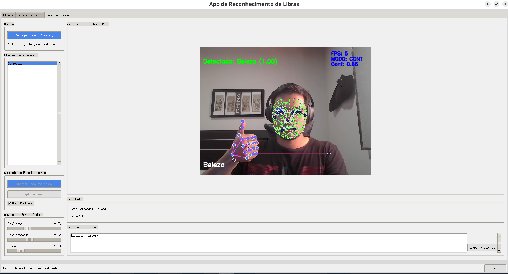

# Reconhecimento de Sinais  em Tempo Real




**Traduza gestos  em texto em tempo real usando sua webcam!** Este projeto utiliza visão computacional e aprendizado profundo para construir um sistema interativo de reconhecimento de sinais.

---

## 📜 Sumário

- [🌟 Funcionalidades Principais](#-funcionalidades-principais)
- [🚀 Tecnologias Utilizadas](#-tecnologias-utilizadas)
- [🛠️ Estrutura do Projeto](#️-estrutura-do-projeto)
- [📋 Pré-requisitos](#-pré-requisitos)
- [📦 Instalação](#-instalação)
- [🎮 Como Usar](#-como-usar)
  - [Executando a Aplicação Principal](#executando-a-aplicação-principal)
  - [📊 Coleta de Dados](#-coleta-de-dados)
  - [🧠 Treinando um Novo Modelo](#-treinando-um-novo-modelo)
  - [⚙️ Configurações da Aplicação](#️-configurações-da-aplicação)
- [🔧 Detalhes Técnicos](#-detalhes-técnicos)
  - [Extração de Características](#extração-de-características)
  - [Arquitetura do Modelo](#arquitetura-do-modelo)
- [📈 Resultados e Avaliação](#-resultados-e-avaliação)
- [🔮 Possíveis Melhorias Futuras](#-possíveis-melhorias-futuras)
- [🤝 Contribuições](#-contribuições)
- [📄 Licença](#-licença)
- [📧 Contato](#-contato)

---

## 🌟 Funcionalidades Principais

- **🎥 Reconhecimento em Tempo Real**: Detecta e classifica gestos de Libras diretamente da sua webcam.
- **📊 Coleta de Dados Intuitiva**: Interface gráfica para capturar, nomear e salvar sequências de gestos para criar ou expandir datasets de treinamento.
- **🧠 Treinamento de Modelo Simplificado**: Script dedicado (`TrainModel.py`) para treinar modelos LSTM bidirecionais com os dados coletados, incluindo visualização de métricas.
- **🖥️ Interface Gráfica Amigável**: Aplicação desktop construída com Tkinter, organizada em abas para fácil navegação entre coleta, reconhecimento e configurações.
- **⚙️ Parâmetros Configuráveis**: Ajuste de sensibilidade de detecção, limiares de confiança e outros parâmetros diretamente na interface.
- **📝 Feedback Visual e Textual**: Exibe os gestos detectados, a frase formada e o histórico de reconhecimentos.

---

## 🚀 Tecnologias Utilizadas

- **Linguagem**: Python 3.8+
- **Visão Computacional**: OpenCV, MediaPipe (Holistic para detecção de pose, face e mãos)
- **Aprendizado Profundo**: TensorFlow, Keras (para construção e treinamento de modelos LSTM)
- **Interface Gráfica (GUI)**: Tkinter
- **Manipulação de Dados**: NumPy
- **Visualização**: Matplotlib, Seaborn (usados no script de treinamento)
- **Gerenciamento de Dependências**: Pip com `requirements.txt`

---

## 🛠️ Estrutura do Projeto

```
TrainingDet/
│
├── main.py                  # Aplicação principal com interface gráfica (GUI)
├── TrainModel.py            # Script para treinamento do modelo de reconhecimento
├── requirements.txt         # Lista de dependências do projeto
├── README.md                # Este arquivo de documentação
│
├── Sign_Data_App/           # Diretório para dados de gestos coletados
│   └── [nome_da_acao]/      # Ex: 'Beleza', 'Obrigado', 'Ola'
│       └── [numero_sequencia]/ # Sequências de vídeo (0, 1, 2, ...)
│           └── [frame_num].npy # Keypoints extraídos por frame (formato NumPy)
│
├── Models/                  # Modelos de Keras treinados e salvos
│   └── sign_language_model.keras # Exemplo de modelo treinado
│
└── Logs/                    # Logs de treinamento para visualização no TensorBoard
    └── [timestamp_treino]/  # Arquivos de log para cada sessão de treinamento
```

---

## 📋 Pré-requisitos

- Python 3.8 ou superior.
- Pip (gerenciador de pacotes Python).
- Uma webcam conectada e funcionando.
- (Opcional) Git para clonar o repositório.

---

## 📦 Instalação

1. **Clone o repositório:**

   ```bash
   git clone https://github.com/JPEDROPS092/GestosRecon
   cd TrainingDet
   ```

   (Se você não tem Git, pode baixar o ZIP do projeto e extraí-lo)
2. **Crie e ative um ambiente virtual (recomendado):**

   ```bash
   python -m venv venv
   # No Windows
   venv\Scripts\activate
   # No macOS/Linux
   source venv/bin/activate
   ```
3. **Instale as dependências:**

   ```bash
   pip install -r requirements.txt
   ```

   *Nota: A instalação do TensorFlow pode levar alguns minutos.*

---

## 🎮 Como Usar

### Executando a Aplicação Principal

Para iniciar a interface gráfica do sistema de reconhecimento:

```bash
python main.py
```

A aplicação possui três abas principais:

1. **Câmera**: Configura e visualiza o feed da webcam.
2. **Coleta de Dados**: Para gravar novos gestos.
3. **Reconhecimento**: Para usar o modelo treinado e reconhecer gestos em tempo real.


*(Considere adicionar um screenshot da sua GUI aqui)*

### 📊 Coleta de Dados

Para treinar o modelo com seus próprios gestos ou adicionar novos:

1. Execute `main.py` e vá para a aba **"Coleta de Dados"**.
2. No campo **"Nome da Ação/Gesto"**, digite o nome do gesto que você deseja gravar (ex: "Olá", "Ajuda", "Sim").
3. Clique em **"Iniciar Coleta para esta Ação"**.
4. A câmera será ativada. Siga as instruções na tela:
   * Haverá uma contagem regressiva antes de cada sequência de gravação.
   * Realize o gesto de forma clara durante a gravação de cada sequência.
   * O sistema gravará um número pré-definido de sequências (`NO_SEQUENCES`) com um número pré-definido de frames por sequência (`SEQUENCE_LENGTH`).
5. Os dados (keypoints extraídos) serão salvos automaticamente em `Sign_Data_App/[nome-do-gesto]/`.

**Dicas para uma boa coleta:**

* Mantenha uma boa iluminação.
* Evite fundos muito complexos ou com muito movimento.
* Realize os gestos de forma consistente, mas com pequenas variações para robustez.

### 🧠 Treinando um Novo Modelo

Após coletar dados suficientes para os gestos desejados:

1. Execute o script de treinamento:
   ```bash
   python TrainModel.py
   ```
2. O script irá:
   * Carregar os dados da pasta `Sign_Data_App/`.
   * Pré-processar os dados e dividi-los em conjuntos de treino e teste.
   * Construir e treinar um modelo LSTM bidirecional.
   * Exibir métricas de desempenho (ex: precisão, perda) e gráficos (ex: matriz de confusão, curvas de aprendizado).
   * Salvar o modelo treinado em `Models/sign_language_model.keras` (ou similar).
   * Gerar logs de treinamento em `Logs/` para análise com TensorBoard:
     ```bash
     tensorboard --logdir Logs/
     ```

### ⚙️ Configurações da Aplicação

Na aba **"Reconhecimento"** da aplicação `main.py`, você pode:

* **Carregar um Modelo**: Selecionar um arquivo `.keras` treinado.
* **Ajustes de Sensibilidade**:
  * **Limiar de Confiança**: Define a confiança mínima para uma predição ser considerada.
  * **Consistência do Buffer**: Define o quão consistente uma predição deve ser em um buffer de frames.
  * **Pausa Entre Detecções**: Tempo de espera antes de tentar detectar um novo gesto após uma detecção bem-sucedida no modo contínuo.
* **Modo Contínuo**: Ativar/desativar o reconhecimento automático de gestos sem a necessidade de clicar em "Capturar Gesto".

---

## 🔧 Detalhes Técnicos

### Extração de Características

O sistema utiliza o **MediaPipe Holistic** para extrair um total de **1668** características numéricas por frame de vídeo:

- **Pose Landmarks (33 pontos)**: Coordenadas `x, y, z` e `visibilidade` para cada ponto (33 * 4 = 132 valores).
- **Face Landmarks (468 pontos)**: Coordenadas `x, y, z` para cada ponto (468 * 3 = 1404 valores).
- **Hand Landmarks (21 pontos por mão)**: Coordenadas `x, y, z` para cada ponto (21 * 3 * 2 mãos = 126 valores).
- **Características Calculadas Adicionais (6 valores)**:
  - Distância da mão esquerda ao centro da face.
  - Distância da mão direita ao centro da face.
  - Distância entre o centro da mão esquerda e o centro da mão direita.
  - Distância entre as pontas dos dedos indicadores das duas mãos.
  - Ângulo do vetor (ponta do dedo indicador esquerdo -> centro da face) em relação a um vetor de referência.
  - Ângulo do vetor (ponta do dedo indicador direito -> centro da face) em relação a um vetor de referência.

Estas características são normalizadas e achatadas para formar o vetor de entrada para o modelo.

### Arquitetura do Modelo

O modelo de reconhecimento de gestos emprega uma arquitetura de Rede Neural Recorrente, especificamente uma **LSTM (Long Short-Term Memory) Bidirecional**, ideal para dados sequenciais como vídeos de gestos:

1. **Camada de Entrada**: Recebe sequências de `SEQUENCE_LENGTH` frames, cada frame contendo 1668 características.
2. **Camadas LSTM Bidirecionais**: Múltiplas camadas LSTM que processam a sequência em ambas as direções (passado para futuro e futuro para passado) para capturar dependências temporais complexas.
3. **Camadas de Dropout**: Inseridas entre as camadas LSTM para regularização, ajudando a prevenir overfitting.
4. **Camadas Densas (Fully Connected)**: Camadas densas para processamento adicional das características aprendidas pelas LSTMs.
5. **Camada de Saída**: Uma camada densa final com função de ativação `softmax` para classificar o gesto em uma das `N_ACTIONS` (número de gestos) categorias.

O modelo é treinado usando o otimizador Adam e a função de perda `categorical_crossentropy`.

---

## 📈 Resultados e Avaliação

O script `TrainModel.py` fornece uma avaliação do modelo treinado, incluindo:

* Precisão (accuracy) e perda (loss) nos conjuntos de treino e teste.
* Matriz de confusão para visualizar o desempenho por classe.
* Curvas de aprendizado (precisão e perda ao longo das épocas).

Os resultados podem variar dependendo da qualidade e quantidade dos dados coletados, da complexidade dos gestos e da arquitetura do modelo.

---

## 🔮 Possíveis Melhorias Futuras

- [ ] Adicionar suporte para um vocabulário maior de gestos.
- [ ] Implementar reconhecimento de frases completas (gramática de sinais).
- [ ] Otimizar o modelo para melhor desempenho em dispositivos com menos recursos.
- [ ] Interface para tradução de texto para gestos (animação de avatar).
- [ ] Empacotar a aplicação como um executável standalone (usando PyInstaller ou cx_Freeze).
- [ ] Melhorar a robustez a variações de iluminação, oclusão e ângulos de câmera.
- [ ] Integração com legendas em tempo real para vídeos ou chamadas.

---

## 🤝 Contribuições

Contribuições são muito bem-vindas! Se você tem ideias para melhorias, encontrou algum bug ou quer adicionar novas funcionalidades:

1. Faça um Fork do projeto.
2. Crie uma nova Branch (`git checkout -b feature/sua-feature`).
3. Faça commit das suas alterações (`git commit -m 'Adiciona sua-feature'`).
4. Faça Push para a Branch (`git push origin feature/sua-feature`).
5. Abra um Pull Request.

Por favor, certifique-se de que seu código segue as boas práticas e está bem comentado.

---

## 📄 Licença

Este projeto está licenciado sob a Licença MIT. Veja o arquivo `LICENSE` (você precisará criar um) para mais detalhes.

```
MIT License

Copyright (c) [2025] [João Pedro Pereira Santiago ]

Permission is hereby granted, free of charge, to any person obtaining a copy
of this software and associated documentation files (the "Software"), to deal
in the Software without restriction, including without limitation the rights
to use, copy, modify, merge, publish, distribute, sublicense, and/or sell
copies of the Software, and to permit persons to whom the Software is
furnished to do so, subject to the following conditions:

The above copyright notice and this permission notice shall be included in all
copies or substantial portions of the Software.

THE SOFTWARE IS PROVIDED "AS IS", WITHOUT WARRANTY OF ANY KIND, EXPRESS OR
IMPLIED, INCLUDING BUT NOT LIMITED TO THE WARRANTIES OF MERCHANTABILITY,
FITNESS FOR A PARTICULAR PURPOSE AND NONINFRINGEMENT. IN NO EVENT SHALL THE
AUTHORS OR COPYRIGHT HOLDERS BE LIABLE FOR ANY CLAIM, DAMAGES OR OTHER
LIABILITY, WHETHER IN AN ACTION OF CONTRACT, TORT OR OTHERWISE, ARISING FROM,
OUT OF OR IN CONNECTION WITH THE SOFTWARE OR THE USE OR OTHER DEALINGS IN THE
SOFTWARE.
```


---

## 📧 Contato

João pedro Pereira Santiago –  – jpedropsss@gmail.com
